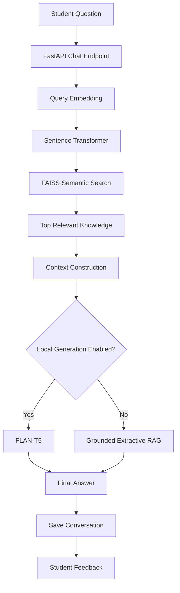
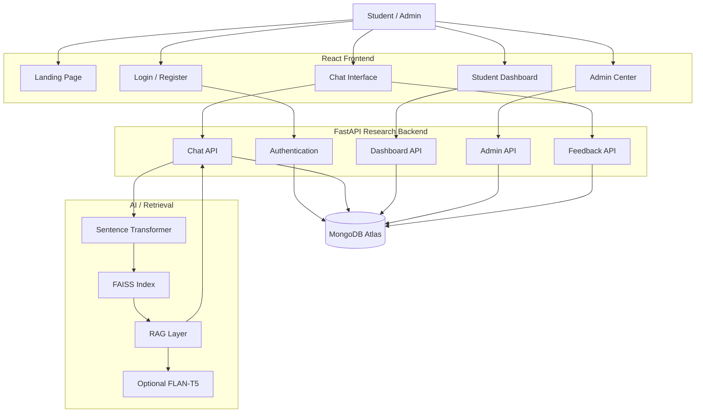
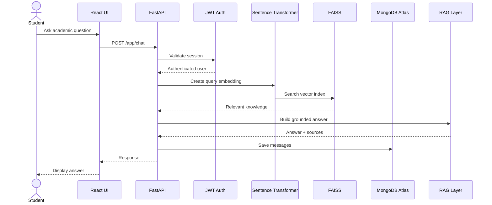
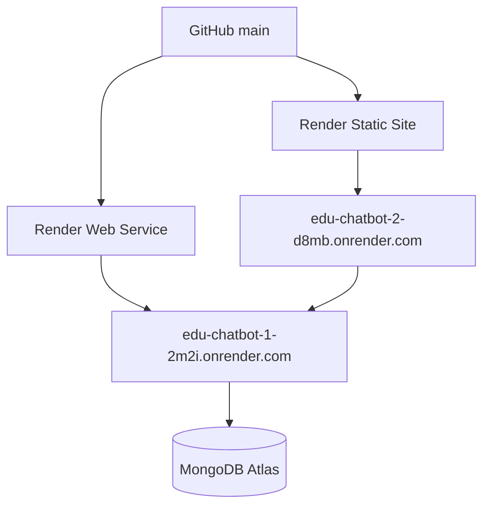

# 🎓 EduBot — AI-Powered Educational Chatbot

<p align="center"><strong>AI-powered educational assistance using NLP, semantic retrieval, embeddings, and Retrieval-Augmented Generation.</strong></p>

<p align="center">
  <a href="https://edu-chatbot-2-d8mb.onrender.com"></a>
  <a href="https://github.com/abhikumar19999999-maker/edu-chatbot"></a>
</p>

<p align="center">


</p>

---

## 🌐 Live Application

**Frontend:** https://edu-chatbot-2-d8mb.onrender.com  
**Research API:** https://edu-chatbot-1-2m2i.onrender.com  
**Health:** https://edu-chatbot-1-2m2i.onrender.com/health

The production research frontend communicates with the FastAPI backend through authenticated `/app` routes.

---

## 📖 About

EduBot is an AI-powered educational chatbot designed to help students ask academic questions and receive answers grounded in a curated educational knowledge base.

The current research implementation combines:

- React + Vite frontend
- Python + FastAPI backend
- Sentence Transformers embeddings
- FAISS semantic retrieval
- MongoDB Atlas persistence
- Retrieval-Augmented Generation (RAG)
- Optional local FLAN-T5 generation
- Grounded extractive fallback when local generation is disabled
- JWT authentication with HTTP-only cookies
- Student dashboard and conversation history
- Admin dashboard and knowledge management
- Student feedback collection

The main principle is:

```text
Question → Embedding → Semantic Retrieval → Relevant Knowledge → Grounded Answer
```

---

## 📚 Research Paper

**“Design and Development of an AI-Powered Educational Chatbot Using Natural Language Processing and Machine Learning”**

**Authors**

- Abhi Kumar — B.Tech 3rd Year, CSE
- Sachin Singh — B.Tech 3rd Year, CSE
- Yash Sharma — B.Tech 3rd Year, CSE
- Hi-Tech Institute of Engineering and Technology

---

## 🎯 Problem Statement

Students often need quick explanations of academic concepts while studying independently. Traditional search can require multiple websites, manual filtering, and checking whether information is relevant to the student's subject.

EduBot simplifies this workflow:

```text
Student Question
       ↓
Query Processing
       ↓
Semantic Embedding
       ↓
FAISS Retrieval
       ↓
Relevant Educational Knowledge
       ↓
Grounded Response
       ↓
Student
```

---

## ✨ Features

### 👨‍🎓 Student

- Secure registration and login
- JWT session authentication
- AI educational chat
- Subject selection
- Semantic knowledge retrieval
- Conversation history
- New conversations
- Persistent messages
- Helpful / not-helpful feedback
- Student dashboard
- User avatar
- Responsive interface
- Secure logout

### 🛠️ Admin

- Role-based admin authorization
- Admin dashboard
- User management
- Subject management
- Knowledge-base management
- Feedback monitoring
- Add, edit and delete knowledge
- Activate/deactivate records
- System statistics

> New registrations are created as `student` accounts. Admin access is protected by the backend.

---

## 🧠 AI Architecture



### Retrieval

The backend uses `sentence-transformers/all-MiniLM-L6-v2` to create semantic embeddings and FAISS for similarity search. Knowledge records are loaded from MongoDB Atlas and indexed in memory when the API initializes.

### Generation

The configured generation model is `google/flan-t5-small`. Local generation can be enabled or disabled through `ENABLE_LOCAL_GENERATION`. When disabled, the system uses a grounded extractive RAG response from retrieved knowledge.

---

## 🏗️ System Architecture



---

## 🔐 Authentication & Authorization

EduBot uses JWT authentication stored in an HTTP-only cookie.

```text
Register / Login
       ↓
Verify credentials
       ↓
Create JWT
       ↓
Secure HTTP-only cookie
       ↓
Authenticated request
       ↓
Role verification
       ↓
Student / Admin access
```

Admin routes require:

```text
Authenticated session
        AND
role == "admin"
```

Ordinary registration never grants admin privileges.

---

## 📚 Knowledge Base

Knowledge records can contain:

- Title
- Question
- Answer
- Topic
- Keywords
- Difficulty
- Source
- Subject
- Embedding
- Active/inactive status

During initialization, knowledge records are converted into vectors and indexed with FAISS.

---

## 🔎 Semantic Retrieval

```text
Knowledge Records
       ↓
Text Preparation
       ↓
Sentence Transformer
       ↓
Embedding Vectors
       ↓
FAISS Index

Student Question
       ↓
Query Embedding
       ↓
Similarity Search
       ↓
Top-K Relevant Records
       ↓
RAG Context
```

The number of retrieved records and similarity threshold are configurable.

---

## 💬 Chat Workflow



---

## 📊 Student Dashboard

The dashboard uses stored activity to show conversations, questions, bot responses, feedback ratings, helpful answers, subjects studied, and recent activity.

---

## 🛠️ Admin Center

The Admin Center provides protected management for:

```text
Users
Subjects
Knowledge
Feedback
Statistics
```

Only authenticated users with the `admin` role can access these endpoints.

---

## 🗄️ Database

MongoDB Atlas stores persistent application data.

| Collection | Purpose |
|---|---|
| `users` | Student/admin accounts and roles |
| `subjects` | Academic subjects |
| `knowledges` | Educational knowledge records |
| `conversations` | User conversations |
| `messages` | User and bot messages |
| `feedbacks` | Student feedback |

FAISS provides the runtime vector index for semantic retrieval.

---

## 📁 Project Structure

```text
edu-chatbot/
├── research_frontend/
│   ├── src/
│   │   ├── App.jsx
│   │   ├── Auth.jsx
│   │   ├── ChatView.jsx
│   │   ├── Dashboard.jsx
│   │   ├── Admin.jsx
│   │   ├── main.jsx
│   │   ├── style.css
│   │   ├── auth.css
│   │   ├── home.css
│   │   └── admin.css
│   ├── index.html
│   ├── package.json
│   └── render.yaml
├── research_backend/
│   ├── main.py
│   ├── features.py
│   ├── app.py
│   ├── evaluate.py
│   ├── requirements.txt
│   ├── Dockerfile
│   └── render.yaml
├── server/              # Legacy Node.js implementation
├── public/              # Legacy frontend assets
├── render.yaml
└── README.md
```

---

## 🛠️ Technology Stack

| Layer | Technology |
|---|---|
| Frontend | React 19 + Vite |
| Backend | Python + FastAPI |
| Database | MongoDB Atlas |
| Embeddings | Sentence Transformers |
| Embedding Model | `sentence-transformers/all-MiniLM-L6-v2` |
| Vector Retrieval | FAISS |
| Generation | FLAN-T5 Small (optional) |
| AI Pattern | Retrieval-Augmented Generation |
| Authentication | JWT + HTTP-only cookies |
| Password Hashing | bcrypt |
| API Server | Uvicorn |
| Version Control | Git + GitHub |
| Deployment | Render |

---

## 🔌 API Overview

**Research API:** `https://edu-chatbot-1-2m2i.onrender.com`

### Health

```http
GET /health
```

### Authentication

```http
POST /app/auth/register
POST /app/auth/login
POST /app/auth/logout
GET  /app/auth/me
```

### Subjects

```http
GET /app/subjects
```

### Chat

```http
POST   /app/chat
GET    /app/chat/history
GET    /app/chat/:conversation_id
DELETE /app/chat/:conversation_id
```

### Feedback

```http
POST /app/feedback
GET  /app/feedback/mine
```

### Dashboard

```http
GET /app/dashboard
```

### Admin

```http
GET /app/admin/dashboard
```

Additional protected admin endpoints support user, subject, knowledge, and feedback management.

---

## ⚙️ Environment Variables

### Backend

```env
MONGODB_URI=mongodb+srv://<username>:<password>@<cluster>/<database>
MONGODB_DB=edubot
JWT_SECRET=replace-with-a-long-random-secret
FRONTEND_URL=http://localhost:5173

EMBEDDING_MODEL=sentence-transformers/all-MiniLM-L6-v2
GENERATION_MODEL=google/flan-t5-small
TOP_K=5
MIN_RETRIEVAL_SCORE=0.25
ENABLE_LOCAL_GENERATION=false
```

Never commit real credentials, database passwords, or JWT secrets.

### Frontend

```env
VITE_API_URL=https://edu-chatbot-1-2m2i.onrender.com
```

Vite variables are embedded at build time, so changes require a frontend rebuild/deployment.

---

## 🚀 Run Locally

### 1. Clone

```bash
git clone https://github.com/abhikumar19999999-maker/edu-chatbot.git
cd edu-chatbot
```

### 2. Backend

```bash
cd research_backend
python -m venv .venv
```

Windows:

```bash
.venv\Scripts\activate
```

macOS/Linux:

```bash
source .venv/bin/activate
```

Install and run:

```bash
pip install -r requirements.txt
uvicorn app:app --reload --host 0.0.0.0 --port 8000
```

### 3. Frontend

In another terminal:

```bash
cd research_frontend
npm install
npm run dev
```

Set the frontend API URL for local development:

```env
VITE_API_URL=http://localhost:8000
```

---

## ☁️ Production Deployment



### Frontend

```yaml
rootDir: research_frontend
buildCommand: npm install && npm run build
staticPublishPath: ./dist
```

### Backend

```yaml
rootDir: research_backend
buildCommand: pip install -r requirements.txt
startCommand: uvicorn app:app --host 0.0.0.0 --port $PORT
healthCheckPath: /health
```

Both service configuration files are stored in the repository.

---

## 🔒 Security

- HTTP-only authentication cookies
- Secure production cookies
- JWT expiration
- bcrypt password hashing
- Role-based admin authorization
- Protected user-specific conversations
- Protected feedback access
- Pydantic input validation
- Environment-based secrets
- CORS controlled by `FRONTEND_URL`

Production secrets should be configured in Render environment variables.

---

## 🧪 Research Evaluation

Recommended measurable evaluation areas include:

- Retrieval relevance / similarity scores
- Response latency
- Grounded response rate
- Student helpfulness ratings
- Knowledge-base coverage
- Authentication and authorization correctness
- System availability

Numerical performance claims should be based on measurements collected from the system.

---

## 📌 Implementation Note

This repository contains the earlier Node.js application as well as the newer research implementation.

The current research deployment documented above uses:

```text
React
  +
FastAPI
  +
Sentence Transformers
  +
FAISS
  +
MongoDB Atlas
  +
RAG
```

The older `server/` and `public/` implementation remains as the legacy application.

---

## 🚀 Future Improvements

- Better multi-turn conversational context
- Improved source/citation display
- Larger curated educational datasets
- Retrieval reranking
- Stronger optional local generation
- Automated evaluation datasets
- Precision@K / Recall@K benchmarking
- Teacher/faculty accounts
- Advanced analytics
- Production monitoring

---

## 📄 License

This project is developed as an academic/research project. Add an institution-approved open-source license if the project is later released publicly.

---

<p align="center"><strong>🎓 EduBot — Learn smarter with grounded AI.</strong></p>
